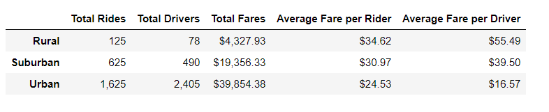
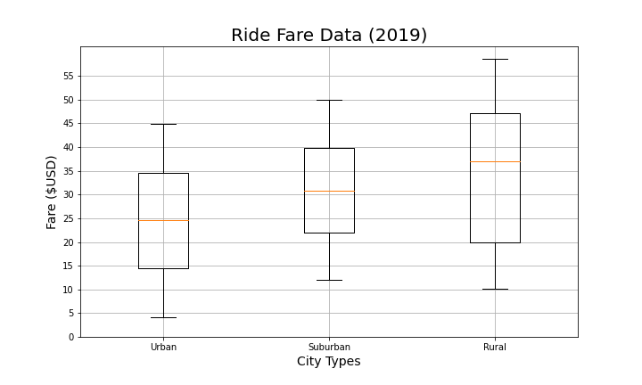
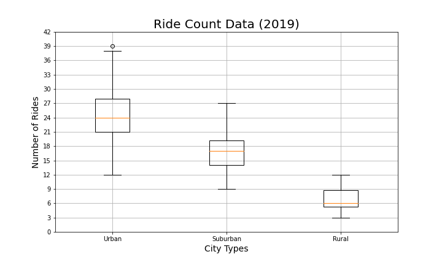
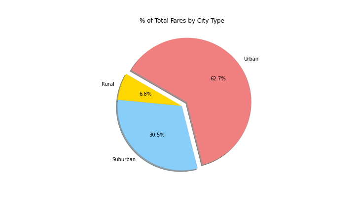

# PyBer Analysis

## Overview of Project

For this project, I created visualizations of 2019 ride-share data for PyBer Analysis to help improve access to ride-sharing services and determine affordability for under-served communities. 
The company also requested that I create a summary DataFrame of the ride-sharing data by city type and a line plot that shows the total weekly sum of the fares for each type of city.

### Purpose

The purpose of this project is summarize how the data differs by city type and how those differences can be used by decision-makers at PyBer Analysis.

## Resources

- Data Source: city_data.csv, ride_data.csv
- Software: Python 3.7.7, Matplotlib 3.2.2, JupyterLab 2.1.5, Pandas 1.0.5, matplotlib 3.2.2

## Analysis and Challenges

I performed exploratory analysis on ride-sharing data from CSV files, creating graphs and charts in JupyterLab to gain data-driven insights.
To do this, I learned how to graph and annotate data using the Matplotlib module and the statistical Python package, SciPy.
Then, using Pandas and Matplotlib, I created a multiple-line graph that shows the total weekly fares for each city type. 

### Analysis Description

To produce a ride-sharing summary DataFrame by city type, I used the Pandas `groupby()` function with the `count` and `sum` methods.

```py
#  1. Get the total rides for each city type
total_rides = pyber_data_df.groupby('type')['ride_id'].count()
...
# 2. Get the total drivers for each city type
total_drivers = city_data_df.groupby('type')['driver_count'].sum()
...
#  3. Get the total amount of fares for each city type
total_fares = pyber_data_df.groupby('type')['fare'].sum()
...
#  4. Get the average fare per ride for each city type. 
avg_fare_per_ride = total_fares / total_rides
...
# 5. Get the average fare per driver for each city type. 
avg_fare_per_driver = total_fares / total_drivers
...
#  6. Create a PyBer summary DataFrame. 
pyber_summary_df = pd.DataFrame({
    "Total Rides" : total_rides,
    "Total Drivers" : total_drivers,
    "Total Fares" : total_fares,
    "Average Fare per Rider" : avg_fare_per_ride,
    "Average Fare per Driver" : avg_fare_per_driver
})
pyber_summary_df
```
For the line plot that shows the total weekly of the fares for each type of city from January 1, 2019 to April 29, 2019, I used Pandas and the `pivot()` and `resample()` functions. I also formatted the output in a style specified by PyBer.

```py
#Create a pivot table with the 'date' as the index, the columns ='type', and values='fare' 
# to get the total fares for each type of city by the date. 
total_fares_df = pyber_data_df.groupby(by=['type','date'])[['fare']].sum()
...
total_fares_df_reset = total_fares_df.reset_index()
total_fares_pivot = total_fares_df_reset.pivot(index='date', columns='type', values='fare')
...
# Create a new DataFrame from the pivot table DataFrame using loc on the given dates, '2019-01-01':'2019-04-29'.
specific_date_df = total_fares_pivot.loc['2019-01-01':'2019-04-29']
...
# Set the "date" index to datetime datatype. This is necessary to use the resample() method in Step 8.
specific_date_df.index = pd.to_datetime(specific_date_df.index)
...
# Create a new DataFrame using the "resample()" function by week 'W' and get the sum of the fares for each week.
date_resampled_df = specific_date_df.resample('W').sum()
# Import the style from Matplotlib.
from matplotlib import style
# Use the graph style fivethirtyeight.
style.use('fivethirtyeight')

# 1Using the object-oriented interface method, plot the resample DataFrame using the df.plot() function. 

ax = date_resampled_df.plot(
    title="Total Fare by City Type",
    figsize=(20,7), 
)
ax.set_xlabel('')
ax.set_ylabel('Fare ($USD)')
fig = ax.get_figure()
fig.savefig("analysis/PyBer_fare_summary.PNG")

```

### Challenges and Difficulties Encountered

I had never used the `pivot()` or `resample()` functions before embarking on this project. 
Luckily, Google sensei was very helpful, but it took some time to figure out some of the syntax for these functions.
I also had to remember how to implement some Pandas tools that I had used previously and double check the starter code which had a few typos that initially threw me off.

## Results

- From looking at the chart below showing PyBer ride-sharing data among the different city types, it is evident that drivers are more numerous in urban urban and that fares (on average) appear to be lower in urban cities, but there are a higher number of riders in urban city areas.
  
  
  Note: Circle size in the graph correlates with driver count per city.

- The summary table for ride-sharing data, including the total rides, total drivers, total fares, average fare per ride and driver, and total fare by city type, shows:
  
  1. The most rides occurred in urban cities, followed by suburban cities then rural cities.  This trend held true for total drivers as well.
  2. As far as the total fares, urban produced the highest total fares, then suburban, followed by rural.
  3. However, our table shows that the average fare per rider and per driver was highest in the rural cities followed by suburban cities and ending with urban ones. This might be because of supply and demand.
   
  

- From the combined box-and-wisker plot data of Ride Fare Data I created as part of summary statistics, we see that there are no outliers obviously skewing our data.
We can also see that average fare for rides in the rural cities is about $11 and $5 more per ride than the urban and suburban cities, respectively -- holding true with the summary table above.

  

- The average number of drivers in rural cities is nine to four times less per city than in urban and suburban cities, respectively. 
  Similar to the box-and-whisker plot above, there are no outliers in this data set and the data supports the information we gained from our summary table.
  By looking at the driver count data and the fare data, we can also get a sense of the overall revenue from each of the city types.
  
  

- The box-and-whisker plot for the number of rides for each city type in combination with the Ride Fare Data above indicates that overall revenue was higher for urban areas followed by suburban and then urban areas, which is in line with our summary table.
  There is an outlier in this data set, which does shape how we should see the average of our ride count data in our summary table.

  

- Pie charts reviewing the percent of total fares, rides and drivers by city types indicate what our other results have showed: that urban cities have the largest percent of total fares, rides and drivers followed by suburban and rural cities respectively.
  
  
  
  

- The final line chart I created, a display of total fares by city type from January to April 2019, shows that total fares are highest in urban cities followed by suburban cities and then rural ones.
  There also appears to be dips and increases around the same time for each of the city areas that might be worth looking into at some point. 
  These dips could be influenced by weather, school/work vacations or holidays.

  

## Summary
- From the data, we can see that rural cities are the most under-served areas, followed by suburban cities, even though average fares are higher in these areas.
  This could be because of supply and demand, but more analysis would need to take place to be certain.
  Based on the results of my analysis, I would recommend the CEO address disparities among the city types by:
    
    1. Look into ways to increase the number of drivers in rural and suburban areas to increase service to these communities.
   Increasing drivers might lead to higher revenues because these city types offer higher average fares per rider and driver.
    1. After increasing the number of drivers in rural and suburban cities (or before!), target ads and/or increase information about the ride-share service to spread knowledge of the service and increase users. 
   It might also be a good idea to find out how many users in rural or suburban cities would actually take advantage of ride-shares.
    1. Subsidize or offer discounts for users in rural and suburban cities. This could incentivize more users in these city types to use the ride-share, especially because average costs tend to be higher for these locations. 